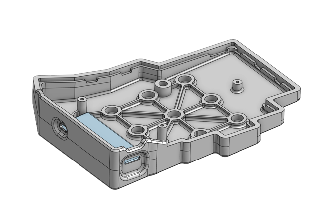

# ZMK Chocofi Keymap  

Keymap for [Chocofi by Pastutk](https://github.com/pashutk/chocofi) inspired by Fifi keyboard.
Created with [ZMK](https://zmkfirmware.dev/).  
Inspired by the [Miryoku layout by Manna Harbour](https://github.com/manna-harbour/qmk_firmware/blob/miryoku/users/manna-harbour_miryoku/miryoku.org).  

## Features
- Split, column-staggered, 5 x 3 + 3 layout
- Homerow modifiers (Shift, Control, Alt, Super)
- Numpad
- Navigation keys
- Media keys
- Layout switch (Colemak DHm and QWERTY)
- Bluetooth
- Nice!View displays

## Keymaps

Illustrations powered by keymap-drawer

(t.b.d)

## CAD

